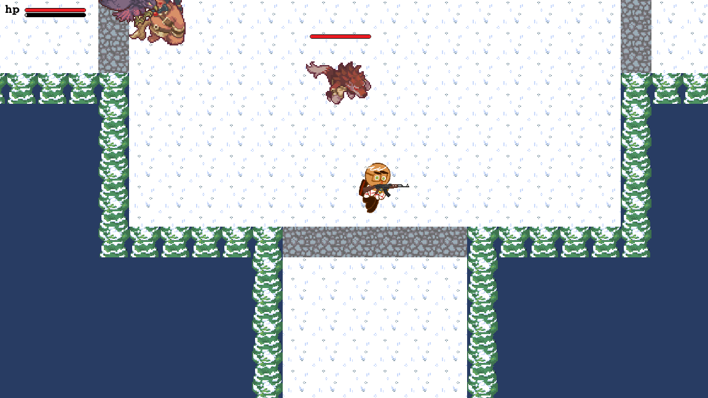

# Soul Knight 모작 2D 액션 슈팅 게임

Python과 Pico2D로 제작한 개인 프로젝트입니다. 고정된 던전의 전투 구역을 순서대로 돌파하고 포탈을 통해 보스전에 진입하는 탑다운 슈팅 게임입니다.

<p align="center">
  
</p>
<p align="center"><sub>Windows · Python 3.13.7 · Pico2D 1.5.1에서 직접 실행한 zone1 전투 화면입니다. (2026-08-08)</sub></p>

| 항목 | 내용 |
| --- | --- |
| 개발 기간 | 2024년 2학기 |
| 개발 형태 | 개인 프로젝트 |
| 기술 | Python, Pico2D, Tiled Map |
| 장르 | 2D 탑다운 액션 슈팅 |

## 구현 범위

수업에서 제공된 `gfw` 프레임워크를 기반으로 게임플레이 로직을 구현했습니다.

- WASD 8방향 이동, 구르기와 무적 판정, 카메라 추적
- 체력과 구르기 쿨타임 UI
- 전투 구역 상태 관리와 출구 잠금·해제
- 무기 5종, 투사체 풀링, 자동 조준과 충돌 판정
- 일반 적 3종과 보스의 상태 기반 AI
- 일반 맵에서 보스 맵으로 전환
- 게임 오버와 게임 클리어 흐름

## 주요 시스템

### 전투 구역 진행

전투 구역을 `Entering`, `Active`, `Complete` 상태로 구분했습니다. 플레이어가 구역에 진입하면 적의 종류와 위치를 정하고 출구 충돌을 활성화하며, 모든 적을 처치하면 출구를 다시 엽니다. 마지막 포탈에서는 기존 맵을 정리한 뒤 보스 맵과 블랙 드래곤을 생성합니다.

맵은 Tiled로 제작한 고정 구조이며, 절차 생성이 아니라 구역별 적 구성만 무작위로 결정됩니다.

### 플레이어와 무기

- 구르기 중 이동 속도 증가와 무적 판정, 1초 쿨타임 적용
- 살아 있는 적 가운데 가장 가까운 대상을 찾아 투사체 방향 계산
- 투사체를 미리 생성하고 비활성화된 객체를 재사용
- Bazooka 명중 지점에 범위 피해 적용

| 무기 | 공격력 | 투사체 속도 | 쿨타임 |
| --- | ---: | ---: | ---: |
| AK-47 | 30 | 400 | 0.3초 |
| Bazooka | 50 | 200 | 1.0초 |
| MP5 | 15 | 400 | 0.2초 |
| Revolver | 45 | 400 | 0.7초 |
| Glock | 10 | 300 | 0.2초 |

### 적 AI와 보스전

일반 적은 플레이어와의 거리에 따라 대기·추적·공격 상태를 전환합니다. 피격 후에는 추적 상태를 유지하고 경직과 넉백을 처리하며, 공격 애니메이션의 마지막 프레임에서 사거리를 다시 확인한 뒤 피해를 적용합니다.

보스는 두 가지 공격 중 하나를 선택합니다. 보스전의 전체 적 수가 6마리 미만이면 일반 적을 추가하고, 보스가 제거되면 게임 클리어 화면으로 전환합니다.

## 코드 구성

| 파일 | 역할 |
| --- | --- |
| [`main_scene.py`](main_scene.py) | 월드 레이어 구성, 맵 로드, 투사체 충돌 검사 |
| [`player.py`](player.py) | 플레이어 조작, 구르기, UI, 구역·맵 전환 |
| [`weapon.py`](weapon.py) | 무기 5종, 투사체 이동, 자동 조준, 범위 피해 |
| [`enemy.py`](enemy.py) | 일반 적과 보스 생성, 상태 기반 AI |
| [`game_over_scene.py`](game_over_scene.py) | 게임 오버 화면 |
| [`game_end_scene.py`](game_end_scene.py) | 게임 클리어 화면 |

## 조작법

| 키 | 동작 |
| --- | --- |
| `W` `A` `S` `D` | 이동 |
| `J` | 구르기 |
| `K` | 공격 |
| `L` | 무기 교체 |
| `Esc` | 종료 |

## 실행 방법

Windows PowerShell에서 격리 환경을 만들고 검증한 의존성을 설치한 뒤 실행합니다.

```powershell
python -m venv .venv
.\.venv\Scripts\python.exe -m pip install -r requirements.txt
.\.venv\Scripts\python.exe main_scene.py
```

## 빌드·실행 확인

2026-08-08 Windows, Python 3.13.7, Pico2D 1.5.1에서 1152×648 창 실행, 이동·스크롤·`zone1` 진입, 적 생성, 피격·HP 감소와 게임 오버 전환을 확인했습니다. 두 실행 모두 표준 오류 출력 없이 종료했습니다.

## 리소스 안내

`gfw/`는 수업 제공 프레임워크이며 `res/`에는 외부 게임에서 유래한 이미지·폰트 리소스가 포함되어 있습니다. 이 저장소는 학습 목적의 비상업 프로젝트이며, 코드 외 리소스의 재배포 전에는 각 권리를 별도로 확인해야 합니다.


